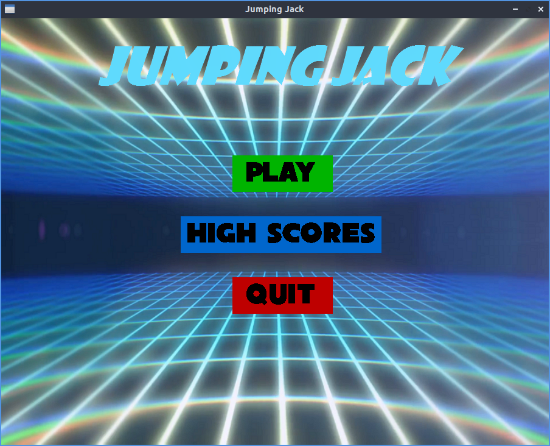
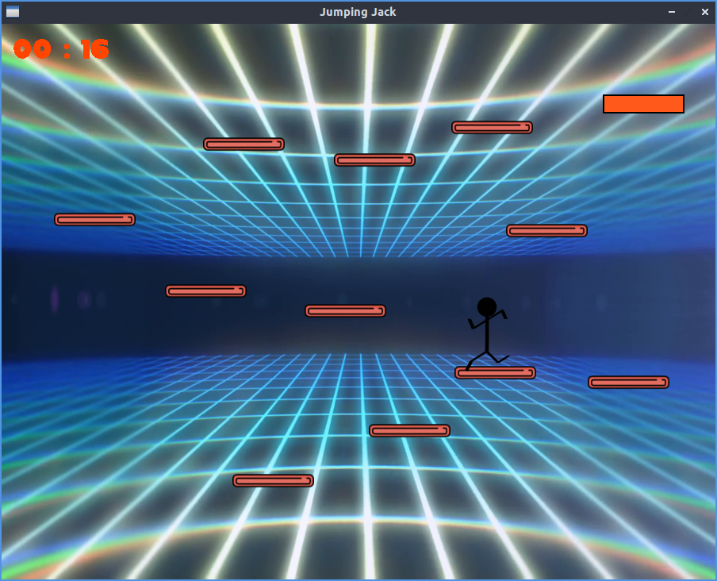
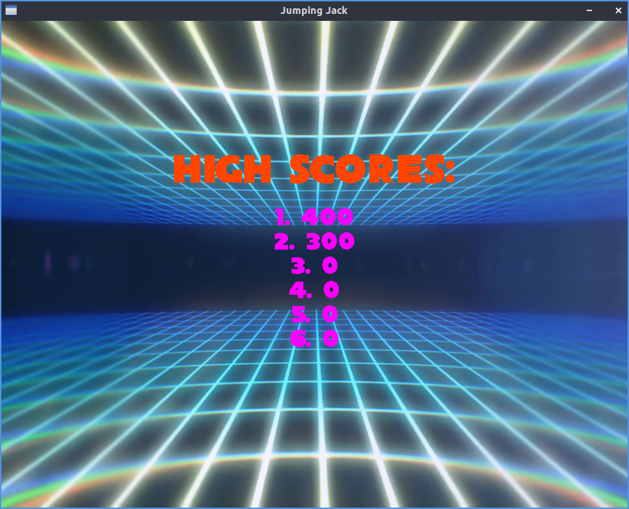

# Jumping Jack

An arcade game, written in Python 3, using [pygame](https://www.pygame.org/) module. Jack, a stickman, starts at the corner of the screen, whose movement can be controlled via keyboard keys - left, right and up arrow to jump. The objective is to get him to the destination, at the other corner of the screen, by jumping across platforms. The score is determined based on the time taken to get Jack to the destination.

CBSE Class XI Project by Adithya R, Shri Dhriti, Gopika J (2018-19)

Screenshots
-----------

